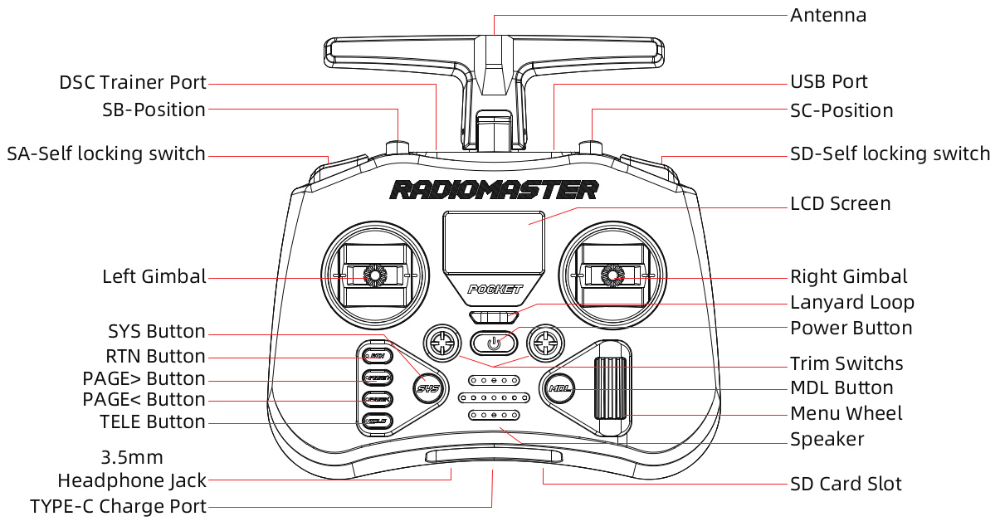
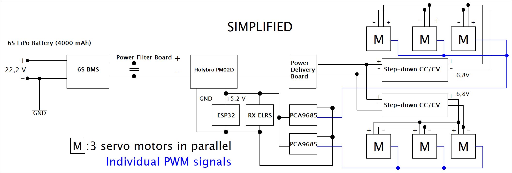

# 🤖 Hexadrone

## 🏗️ Project Architecture

The workspace is strictly divided to ensure the core mathematics remain perfectly portable between the high-level ROS 2 simulation and the low-level ESP32 microcontroller.

* **🧠 `hexadrone_core/` (The Brain)**
  * **Pure C++:** No ROS or ESP dependencies. Portable everywhere.
  * **`brain.cpp`**: Master coordinator, state machine, and real-time mixing.
  * **`kinematics.cpp`**: Forward Kinematics (FK) solver, dynamic body leaning, and servo safety clamping.
  * **`gait_engine.cpp`**: Generates elliptical walking paths, tripod balancing, and differential yaw.
* **🎮 `hexadrone_controller/` (The ROS 2 Wrapper)**
  * **`bridge_ops.hpp`**: Stateless translator converting `sensor_msgs/Joy` to normalized Core data.
  * **`teleop_node.cpp`**: Subscribes to `/joy`, ticks the Brain, and publishes to Webots.
* **🤖 `hexadrone_description/` (The Blueprint)**
  * Contains the `drone.urdf` (source of truth for dimensions), `.stl` visual meshes, and `ros2_control` configurations.
* **🌍 `hexadrone_webots/` (The Virtual Environment)**
  * Holds the Webots `hexaworld.wbt` testing ground, generated `.proto` nodes, and the ROS 2 `launch.py` scripts.
* **⚡ `hexadrone_esp32/` (The Physical Hardware)**
  * PlatformIO project that symlinks to `hexadrone_core`.
  * Manages ESP32 specifics: WiFi/OTA (`comms_manager`), CRSF decoding (`radio_manager`), PCA9685 PWM (`servo_manager`), INA228 Telemetry (`power_manager`), and Buffered File-System IO (`logger`).
* **📻 `Radiomaster/` (Transmitter Profiles)**
  * Contains the EdgeTX backup and configuration files specifically tuned for the RadioMaster Pocket. By copying these to the radio's SD card, you can instantly clone the exact control scheme without manual programming.
  * **`MODELS/`**: Houses the Hexadrone model profile. It pre-configures all 12 channels, including the custom logical switches for the trim-based Leg Selector and the EdgeTX telemetry alarms (e.g., haptic warnings for low voltage).
  * **`RADIO/`**: Contains the global radio settings, UI layout, and hardware calibrations required to map the physical layout of the Pocket to the Hexadrone's expected inputs.

## 🕹️ Control Mapping (RadioMaster Pocket / ELRS)

| Channel  | Input           | Function            | Logic / Behavior                         |
| :------- | :-------------- | :------------------ | :--------------------------------------- |
| **CH1**  | Right Stick (X) | **Body Roll**       | Lean left/right                          |
| **CH2**  | Right Stick (Y) | **Body Pitch**      | Lean forward/back                        |
| **CH3**  | Left Stick (Y)  | **Velocity (Gas)**  | Magnitude of the walking gait            |
| **CH4**  | Left Stick (X)  | **Yaw (Turn)**      | Rotation around the vertical Z-axis      |
| **CH5**  | Switch SA       | **ARM / Safety**    | High: 1 (Armed) / Low: -1 (Disarmed)     |
| **CH6**  | Switch SB       | **Standing Height** | 3-Pos: Crouch (-1) / Std (0) / High (1)  |
| **CH7**  | Switch SC       | **Transmission**    | 3-Pos: Fwd (-1) / Neutral (0) / Bwd (1)  |
| **CH8**  | Left Trim (Y)   | **Manual Tibia**    | Extension reach for selected leg         |
| **CH9**  | Button SE       | **Kill-Switch**     | Immediate Hard Software Cutoff           |
| **CH10** | Left Trim (X)   | **Leg Selector**    | Cycle Legs 1-6 (Rising Edge Detect)      |
| **CH11** | Right Trim (X)  | **Manual Coxa**     | Horizontal swing for selected leg        |
| **CH12** | Right Trim (Y)  | **Manual Femur**    | Vertical lift for selected leg           |

### ROS 2 /joy Topic Index Map in bridge_ops.hpp

| Index Type  | Index      | Physical Control | Range / Logic (In C++)                        |
|-------------|------------|------------------|-----------------------------------------------|
| **Axes**    | `[0]`      | Right Stick (X)  | -1.0 (Right) to 1.0 (Left) [Inverted]         |
| **Axes**    | `[1]`      | Right Stick (Y)  | -1.0 (Down) to 1.0 (Up) [Inverted]            |
| **Axes**    | `[2]`      | Left Stick (Y)   | -1.0 (Down) to 1.0 (Up) [Inverted]            |
| **Axes**    | `[3]`      | Left Stick (X)   | -1.0 (Right) to 1.0 (Left) [Inverted]         |
| **Axes**    | `[4]`      | Switch SB        | -1.0 (Up) / 0.0 (Mid) / 1.0 (Down) [Inverted] |
| **Axes**    | `[5]`      | Knob S1          | -1.0 (Right) to 1.0 (Left) [Inverted]         |
| **Buttons** | `[0]`      | Switch SA        | 0 (Low) / 1 (High)                            |
| **Buttons** | `[1]`      | Button SE        | 0 (Off) / 1 (On)                              |
| **Buttons** | `[2]`      | Switch SD        | 0 (Low) / 1 (High)                            |
| **Buttons** | `[3, 4]`   | Right Trim (X)   | 3: -1 (Left) / 4: 1 (Right)                   |
| **Buttons** | `[5, 6]`   | Right Trim (Y)   | 5: -1 (Down) / 6: 1 (Up)                      |
| **Buttons** | `[7, 8]`   | Left Trim (Y)    | 7: -1 (Down) / 8: 1 (Up)                      |
| **Buttons** | `[9, 10]`  | Left Trim (X)    | 9: Prev Leg / 10: Next Leg                    |
| **Buttons** | `[11, 12]` | Switch SC        | 11: Forward (-1) / 12: Backward (1)           |

---

### ⚙️ System Logic

#### 1. ARM / DISARM Logic (Switch SA)
* **Armed State (Power On):**
    * **Initialization:** The system sequentially powers the leg motors with a 100ms delay to prevent electrical power spikes, positioning the drone in a prone position defined by the kinematic engine.
    * **Operational Posture:** Once all motors are active, the drone raises the chassis to the standing height set by Switch SB.
* **Disarm State (Power Off):** Initiates the **Soft Cutoff** sequence, safely lowering the drone before cutting power.
* **Radio Failsafe:** If the remote control signal is lost, the system automatically triggers the **Soft Cutoff** to ground the drone and wait for a reconnection.

#### 2. Manual Leg Control (CH11 - CH14)
* **Activation:** This mode is only available when the transmission (Switch SC) is in the Neutral position.
* **Leg Selection (CH14):** Use the trim switch to cycle through and select one of the 6 legs.
* **Joint Control:** Use the remaining trim switches to manually adjust the joints of the selected leg. This bypasses the automatic walking engine, making it useful for clearing mechanical jams or performing maintenance. Resets when changing the transmission.

#### 3. Emergency OE-Kill-Switch (Button SE)
* **Emergency Override:** A direct hardware interrupt designed to stop all movement instantly.
* **Execution:** Holding the button for **1 second** physically cuts the control signal to all motors.
* **Safety Lockout:** Once triggered, the system enters a permanent locked state. Pressing the EN (Reset) button on the ESP32 is sufficient to clear the state.
* **Context:** Reserved for critical emergencies like motor stalls, overheating, or loss of control.

#### 4. Soft Cutoff
* **Phase 1 (Lowering):** The kinematic engine commands the drone to take a prone posture.
* **Phase 2 (De-energizing):** Once in position, the system sequentially cuts power to the leg motors with a 100ms delay.
* **Purpose:** This two-step process prevents harmful electrical current spikes and protects the metal gears in the legs from the mechanical shock of a sudden drop.

## ⚡ Power System

### Power Diagram

### Power Connectors (XT60 Flow)
1. **Battery** (Female) → **BMS** (Male - Soldered)
2. **BMS** (Female - Soldered) → **Power Module** (Male)
3. **Power Module** (Female) → **PDB** (Male - Soldered)

### Battery: 6S1P Partizan Li-ion
- **Capacity:** 4000 mAh (3200 mAh usable / 80%)
- **Energy Budget:** 71.04 Wh
- **Discharge:** 10C (Max 40A / 720W @ 18V)

### Charging Parameters (SkyRC S100neo)
- **Standard Charge:** Use **Balance CHG** mode set to **4.10V**. Set the charge current to **2.00A**.
- **Storage Mode:** If the drone is grounded for more than a few days, run the **Storage** mode to bring all cells to exactly **3.70V/c**. Leaving Li-ions fully charged degrades their capacity.

| Storage (3.80V/c) | Full Charge (4.10V/c) | Nominal (3.70V/c) | Minimum Safe (3.40V/c) | Dangerously Depleted (3.00V/c) |
|-------------------|-----------------------|-------------------|------------------------|--------------------------------|
| **22.80V**        | **24.60V**            | **22.20V**        | **20.40V**             | **18.00V**                     |

### Power Distribution

- **Logic:** 5.2V for ESP32, Servoshields, ELRS Receiver and other logic components
- **Servos Supply:** 6.8V via 2x Step-down converters
- **Efficiency:** 90% (Calculation factor: 1.1×)

## 🔋 Drone Estimated Runtime

| **Scenario**     | **Mode Description**         | **Current/Servo** | **Total Power** | **Runtime** | **HH:MM** |
|------------------|------------------------------|-------------------|-----------------|-------------|-----------|
| **Prone/Rest**   | Electronics on, legs relaxed | 0.05A             | 9.7W            | 438 min     | 07:18     |
| **Standing**     | Holding 4kg (Quiescent)      | 0.20A             | 29.9W           | 142 min     | 02:22     |
| **Observed Avg** | Real mission profile         | 0.36A             | 51.5W           | 83 min      | 01:23     |
| **Active Gait**  | Smooth locomotion            | 0.60A             | 83.8W           | 51 min      | 00:51     |
| **Peak Burst**   | Maximum dynamic effort       | 1.00A             | 137.6W          | 31 min      | 00:31     |
| **Extreme Load** | Continuous resistance        | 1.20A             | 164.6W          | 26 min      | 00:26     |

---

## 📊 Telemetry & System Monitoring

The Hexadrone utilizes a dual-layered telemetry system to ensure safety and real-time battery management. Data is aggregated by the ESP32 from the Holybro PM02D (I2C) and the Cyclone ELRS Receiver (UART).

### 1. On-Board OLED Status Display (128x32) (***Not yet implemented***)
A dedicated 0.91" OLED is mounted to the logic board for "at-a-glance" diagnostics during bench testing and field startup. The display is partitioned into four real-time data lines:

| Line | Display Example | Description (Data Source) |
|------|-----------------|---------------------------|
| **1** | `23.2V \| 3.87V/c` | **Battery Potential:** Total voltage and calculated average per cell (6S). Primary indicator for "Fuel Pressure". |
| **2** | `6.2A \| 144.7W` | **System Load:** Instantaneous current draw and total power consumption. High values indicate mechanical resistance or stall. |
| **3** | `1250 mAh` | **Fuel Consumed:** Total capacity drained since power-on. Acts as the most accurate "Fuel Gauge" regardless of voltage sag. |
| **4** | `-45dBm \| 9:100` | **Link Health:** ELRS signal strength (RSSI) and Link Quality (LQ) for connection monitoring. |

### 2. RadioMaster Pocket (Remote Telemetry)
The **Cyclone ELRS Nano** receiver pushes a high-density telemetry stream to the RadioMaster Pocket. The primary telemetry screen (Screen 1) is configured as a **4x2 Nums** grid to monitor the "Gunslinger" mission status in real-time.

#### **Radiomaster Telemetry Layout**

| Position  | Left Column                         | Right Column                      |
|:----------|:------------------------------------|:----------------------------------|
| **Row 1** | **`Vbat`**: Total Pack Voltage      | **`V/c`**: Average Cell Voltage   |
| **Row 2** | **`Watt`**: Total Power Consumption | **`mAh`**: Capacity Consumed      |
| **Row 3** | **`TPWR`**: Transmitter Power       | **`RSNR`**: Signal-to-Noise Ratio |
| **Row 4** | **`1RSS`**: Uplink Signal Strength  | **`RQly`**: Link Quality (Health) |

#### **Telemetry Thresholds & Diagnostics**

| Sensor   | Unit | Good / Nominal     | Warning / Bad | Description                                                                 |
|----------|------|--------------------|---------------|-----------------------------------------------------------------------------|
| **Vbat** | V    | **22.2V – 24.6V**  | **< 21.0V**   | Main battery voltage. Triggers **Soft Cutoff** landing sequence at 21.0V.   |
| **V/c**  | V    | **3.70V – 4.10V**  | **< 3.50V**   | Average cell voltage ($Vbat / 6$). Essential for monitoring Li-ion health.  |
| **Watt** | W    | **3.0W – 140.0W**  | **> 165.0W**  | Total system power. Spikes indicate mechanical stalls or "Extreme Load".    |
| **mAh**  | mAh  | **0mAh – 3000mAh** | **> 3200mAh** | Total "fuel" gauge. Based on 80% usable capacity of the 4000mAh pack.       |
| **TPWR** | mW   | **10mW – 100mW**   | **250mW**     | Current TX output. 250mW indicates the radio is compensating for obstacles. |
| **RSNR** | dB   | **> 5dB**          | **< -15dB**   | Signal cleanness. Lower values indicate high WiFi noise or interference.    |
| **1RSS** | dBm  | **-30 to -80**     | **< -105**    | Raw uplink signal strength. -105dBm is the physical limit for the link.     |
| **RQly** | %    | **100%**           | **< 80%**     | **Critical Metric.** Percentage of packets successfully reaching the drone. |

### 3. Battery Management & Cutoff Logic
To ensure absolute safety, the battery management thresholds are implemented on **both** the ESP32 logic board (for physical execution) and the RadioMaster transmitter (for operator alerts). 

- **Cell Safety:** The Partizan Li-ion pack (10C rating) is capable of 40A continuous discharge. While the drone's average draw is lower (≈5–10A), the BMS is capable of handling 40A peaks.
- **Telemetry Monitoring:** The Holybro PM02D is used to feed real-time voltage data to the ESP32 via I2C.
- **Dual-Layer Logic:**
    - **Warning (< 21.0V | 3.5V/c for 2 seconds):** Triggers audio/haptic feedback on the RadioMaster Pocket. Logged by the ESP32.
    - **Soft Cutoff (< 20.4V | 3.4V/c for 5 seconds):** Forcibly intercepts the Radio controller's ARM switch on the ESP32 to trigger a graceful landing and alerts the operator.
    - **Immediate Hard Cutoff (< 18.0V | 3.0V/c):** Instantly triggers the Hardware OE-Kill gate on the ESP32 to prevent catastrophic battery damage and alerts the operator.
    - **Power Overload (> 165W for 0.5 seconds):** Triggers a unique haptic/audio warning on the RadioMaster to alert the operator of a mechanical jam or excessive weight load. (***TODO: Logged by the ESP32.***)
    - **USB Bench Mode (< 6.0V):** If the voltage reads below 6V, the system assumes it is being powered via USB (5V logic rail) without a battery attached. All cutoff logic is bypassed by the ESP32 to allow safe desktop debugging.

### 4. Wireless Debugging & Data Logging (Local Network)
The Hexadrone features a state-aware `CommsManager` and a dual-output `Logger` system designed to balance high-speed radio performance with robust diagnostic capabilities.

* **Radio-Priority WiFi:** To prevent 2.4GHz signal interference, WiFi is strictly suppressed while the drone is `ARMED`. The network stack only initializes upon entering a `DISARMED` state (or an Emergency `OE-KILL` state), allowing the drone to connect cleanly to the local network.
* **Buffered Blackbox Logging:** A dedicated `Logger` class (aliased as `Blackbox`) manages two separate data streams: `system.log` and `power.csv`.
* **The Gunslinger Web Terminal:** While `DISARMED`, operators can navigate to `http://hexadrone.local/` (***current bug: ESP32 IP has to be used***) to access the "Maintenance Protocol" UI. From this interface, you can instantly download the system logs, retrieve the power CSV, or wirelessly purge the internal flash storage.
* **Maintenance & OTA Updates:** The system supports wireless firmware deployment via Arduino OTA.

#### 5. ELRS Receiver "Auto-WiFi" State
To facilitate wireless firmware updates, the Cyclone ELRS receiver is programmed with an automatic timeout.
* **Behavior:** If the receiver does not establish a link with the RadioMaster Pocket within **60 seconds** of power-on, it enters **Auto-WiFi Mode**.
* **Visual Indicator:** The receiver LED will begin **blinking rapidly** (Double-blink pattern).
* **Lockout:** While in WiFi mode, the receiver's radio hardware is disabled. It will not respond to the controller until it is rebooted.
* **Resolution:** Power-cycle the drone with the RadioMaster Pocket already turned on, or adjust the `WiFi Auto On Interval` in the ELRS Lua script on the transmitter.

## 🛠 Redundant Power Architecture & Thermal Management

- **Interleaved Fail-Safe Design:** The system utilizes two independent 300W step-down converters. Rather than a simple left/right split, the servos are organized in two interleaved groups to ensure static stability.
    - **Group A:** Left-Front (LF), Right-Middle (RM), Left-Back (LB)
    - **Group B:** Right-Front (RF), Left-Middle (LM), Right-Back (RB)
- **Redundancy Logic:** By powering opposing legs from different converters, the drone maintains a stable **tripod of active legs** even if one step-down unit shuts down. This prevents a catastrophic collapse and allows the drone to remain standing or perform a controlled emergency descent.
- **Current Overhead:** Each group of 9 servos pulls a peak stall current of 10.8A (@ 6.8V). Accounting for 90% converter efficiency, the input draw per converter is ≈11.88A.
    - *Safety Margin:* Operating at 11.88A stays well within the **15A recommended limit**, providing a 20% buffer. This "under-clocking" significantly reduces the risk of thermal shutdown compared to a single-converter setup.

## ⚙️ Hardware Components

- **Microcontroller (ESP32-WROOM):** The central brain of the hexadrone, featuring a convenient USB-C port for programming and a CH340 USB-to-Serial chip. It processes the core kinematics, state machine, WiFi/OTA networking, and I2C/UART data streams.
- **Radio Receiver (Cyclone ELRS 2.4G Nano):** Provides a robust, low-latency control link with a dedicated antenna. It pushes a continuous, high-density telemetry stream back to the operator.
- **Actuators (MG995 Metal Gear Servos):** Strong 180° digital servos equipped with durable metal gears. They are essential for handling the physical stress and momentum spikes of the drone's 4 kg weight.
- **Servo Drivers (PCA9685 16-Channel 12-bit PWM Mini Shield):** Offloads PWM signal generation from the ESP32 via I2C. These shields ensure precise, jitter-free angular control. Two modules are wired in parallel to handle all 18 joints.
- **Battery Management (SEQURE 40A 6S BMS):** A protection board tailored for the 6S pack. It balances cells and protects the system against over-current (up to 40A), over-charging, and deep discharging.
- **Telemetry Sensor (Holybro PM02D 12S HV Power Module):** Measures real-time voltage and current, feeding the data to the ESP32 via I2C. It also steps down the battery voltage to supply a clean 5.2V logic rail for the electronics.
- **Spike Suppression (Rush Blade Power Filter Board):** A TVS (Transient Voltage Suppressor) board that absorbs dangerous inductive voltage spikes ("back EMF") generated when 18 servos move and stop simultaneously, protecting the digital logic.
- **Power Converters (300W 20A CC/CV Step-Down):** High-power buck converters that step down the raw 6S battery voltage (20.4V - 24.6V) to a stable 6.8V for the servo motors.

## 🎛️ Configuration & Tuning (`config.h`)
To ensure maintainability, all critical tuning parameters are centralized in `config.h`. You do not need to modify the C++ manager classes to adjust drone behavior.
* **Battery:** Adjustable float thresholds for warnings, Soft, and Hard cutoffs, allowing quick swaps to different battery chemistries (e.g., standard LiPo vs. Li-ion).
* **Logging Limits:** Configurable RAM `BUFFER_SIZE` (default 1024 bytes) and `MAX_FLUSHES` (default 500) to safely balance flash-memory wear-leveling with mission duration. (***TODO: was changed, requires update***)
* **Timings:** Adjustments for the `SERVO_ARM_INTERVAL` (sequential motor wake-up speed) and `LOG_INTERVAL` (telemetry frequency).

## 📐 Mechanical Configuration

### Leg Dimensions

- **Coxa:** 68 mm
- **Femur:** 86.676 mm
- **Tibia:** 108.551 mm

#### Mounting Angles & Coordinates (from 0,0)

| **Leg ID** | **Location** | **dX (mm)** | **dY (mm)** | **Mounting Angle** |
|------------|--------------|-------------|-------------|--------------------|
| LM / RM    | Middle       | 120.250     | 0           | 90°                |
| LF / RF    | Front        | 96.965      | 136.965     | 54.7°              |
| LB / RB    | Back         | 96.965      | 136.965     | 54.7°              |

- **Servo Limits:** −90° to +90° (Full 180° range)

## 🚀 Future Roadmap & Design Iterations (V2.0)

> While V1.0 focuses on structural validation and power stability, the next iteration aims for peak agility, weight efficiency, and advanced control.
> 

### 1. Structural Upgrades & Material Science

- **Carbon Fiber Integration:** Replace solid plastic sections with **Carbon Fiber Tubes**.
    - *Benefit:* Significant increase in the strength-to-weight ratio (WS). Carbon provides extreme rigidity with a fraction of the weight, reducing the inertia of the legs for faster gaits.
- **Filleting & Stress Distribution:** Implement aggressive edge filleting across all 3D-printed load-bearing parts.
    - *Benefit:* Reducing stress concentration points to prevent fatigue cracks and improving the overall aesthetic finish of the frame.

### 2. Mechanical Reconfiguration (Geometry V2)

- **Elevated Leg Pivot Points:** Redesign the chassis to mount leg attachment points (Coxa) higher than the bottom plate.
    - *Goal:* Increase **ground clearance** for traversing uneven terrain and lower the center of gravity (CoG) relative to the leg workspace.
- **Optimized Leg Placement (Ideal Hexa Angles):** Shift from current mounting angles to a more bio-inspired or kinematically optimal "Ideal Hexapod" configuration.
    - *Benefit:* Maximizing the overlap of leg workspaces, allowing for a 360° omnidirectional walk with fewer kinematic singularities.

### 3. Electronics & Control Paradigm Shift

- **Transition to Serial BUS Servos:** Replace the current PWM-based servos (controlled by PCA9685) with **Digital Serial BUS Servos** (e.g., STS/LX series).
    - **Wiring Efficiency:** Daisy-chain wiring (one cable through the whole leg) instead of 18 individual PWM lines. This drastically reduces the "spaghetti" effect in the chassis.
    - **Bi-directional Feedback:** Real-time monitoring of servo temperature, voltage, and exact position. This allows for *Active Compliance* (sensing when a leg hits an obstacle), not just using pressure sensors.
- **Construction Redesign:** A complete overhaul of the main body to accommodate the internal routing of BUS cables, electronics and battery compartment.

---

### 💡 Engineering Vision for V2.0

> **The ultimate goal** is to move from a "controlled walker" to an "autonomous scout." Elevating the legs and reducing mass with carbon fiber will allow the drone to handle outdoor environments (grass, gravel) where V1.0 might struggle due to low clearance.
>
