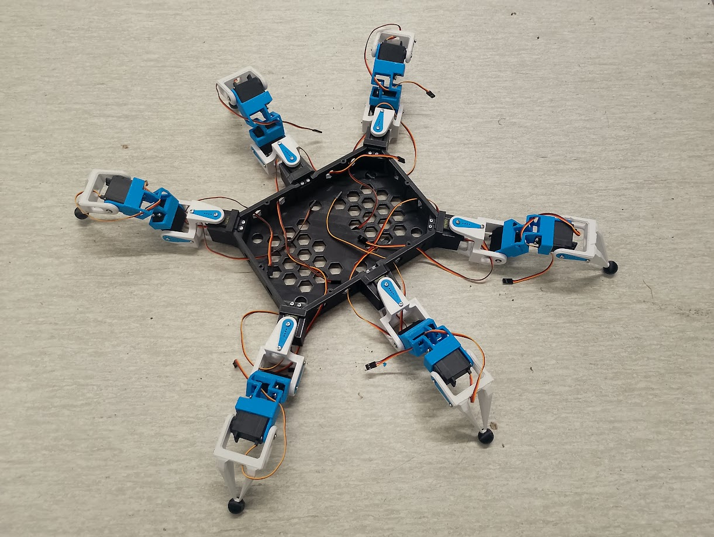
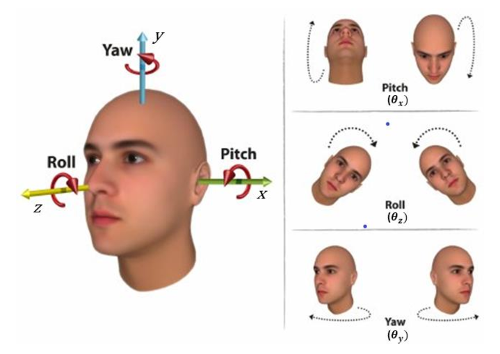

## 🤖 Hexadrone

## 🕹️ Control Mapping (RadioMaster Pocket / ELRS)

| Channel  | Radio Input     | Function            | Logic / Range                                          |
|----------|-----------------|---------------------|--------------------------------------------------------|
| **CH1**  | Right Stick (X) | *Body Roll*         | Additive lean left/right ***(Not yet implemented)***   |
| **CH2**  | Right Stick (Y) | *Body Pitch*        | Additive lean forward/back ***(Not yet implemented*)** |
| **CH3**  | Left Stick (Y)  | **Velocity (Gas)**  | Movement speed (Magnitude of the gait)                 |
| **CH4**  | Left Stick (X)  | **Yaw (Turn)**      | Rotation around the vertical Z-axis                    |
| **CH5**  | Switch SA       | **ARM / Safety**    | High: Armed / Low: Disarmed + Soft Cutoff              |
| **CH6**  | Switch SD       | *Auxiliary*         | Unassigned (Future expansion)                          |
| **CH7**  | Switch SB       | **Standing Height** | 3-Pos: -1:Crouching (Low) / 0:Standard / 1:High Stance |
| **CH8**  | Switch SC       | **Transmission**    | 3-Pos: -1:Forward / 0:Neutral (Manual) / 1:Backward    |
| **CH9**  | Button SE       | **Kill-Switch**     | Immediate Hard cutoff (on condition, see below)        |
| **CH10** | Knob S1         | *Auxiliary*         | Unassigned (Future expansion)                          |
| **CH11** | Right Trim (X)  | **Manual Coxa**     | Horizontal swing for selected leg                      |
| **CH12** | Right Trim (Y)  | **Manual Femur**    | Vertical lift for selected leg                         |
| **CH13** | Left Trim (Y)   | **Manual Tibia**    | Extension/Reach for selected leg                       |
| **CH14** | Left Trim (X)   | **Leg Selector**    | Cycle through Legs 1-6 for individual control          |

---

### ⚙️ System Logic

#### 1. ARM / DISARM Logic (Switch SA)
* **Armed State (Power On):**
    * **Initialization:** The system sequentially powers the leg motors with a 100ms delay to prevent electrical power spikes, positioning the robot in a prone position defined by the kinematic engine.
    * **Operational Posture:** Once all motors are active, the robot raises the chassis to the standing height set by Switch SB.
* **Disarm State (Power Off):** Initiates the **Soft Cutoff** sequence, safely lowering the robot before cutting power.
* **Radio Failsafe:** If the remote control signal is lost, the system automatically triggers the **Soft Cutoff** to ground the robot and wait for a reconnection.

#### 2. Manual Leg Control (CH11 - CH14)
* **Activation:** This mode is only available when the transmission (Switch SC) is in the Neutral position.
* **Leg Selection (CH14):** Use the trim switch to cycle through and select one of the 6 legs.
* **Joint Control:** Use the remaining trim switches to manually adjust the joints of the selected leg. This bypasses the automatic walking engine, making it useful for clearing mechanical jams or performing maintenance.

#### 3. Emergency Kill-Switch (Button SE)
* **Emergency Override:** A direct hardware interrupt designed to stop all movement instantly.
* **Execution:** Holding the button for **1 second** physically cuts the control signal to all motors.
* **Safety Lockout:** Once triggered, the system enters a permanent locked state. Pressing the EN (Reset) button on the ESP32 is sufficient to clear the state.
* **Context:** Reserved for critical emergencies like motor stalls, overheating, or loss of control.

#### 4. Soft Cutoff
* **Phase 1 (Lowering):** The kinematic engine commands the robot to take a prone posture.
* **Phase 2 (De-energizing):** Once in position, the system sequentially cuts power to the leg motors with a 100ms delay.
* **Purpose:** This two-step process prevents harmful electrical current spikes and protects the metal gears in the legs from the mechanical shock of a sudden drop.

## 📐 Mechanical Configuration

### Leg Dimensions

- **Coxa:** 68 mm
- **Femur:** 86.676 mm
- **Tibia:** 108.551 mm

#### Mounting Angles & Coordinates (from 0,0)

| **Leg ID** | **Location** | **dX (mm)** | **dY (mm)** | **Mounting Angle** |
|------------|--------------|-------------|-------------|--------------------|
| LM / RM    | Middle       | 120.250     | 0           | 90°                |
| LF / RF    | Front        | 96.965      | 136.965     | 54.7°              |
| LB / RB    | Back         | 96.965      | 136.965     | 54.7°              |

- **Servo Limits:** −90° to +90° (Full 180° range)

## ⚡ Power System

### Power Diagram

### Battery: 6S1P Partizan Li-ion

- **Capacity:** 4000 mAh (3400 mAh usable / 85%)
- **Energy Budget:** 68 Wh
- **Discharge:** 10C (Max 40A / 720W @ 18V)

| Storage (3.80V/c) | Full Charge (4.10V/c) | Nominal (3.70V/c) | Minimum Safe (3.40V/c) | Dangerously Depleted (3.00V/c) |
|-------------------|-----------------------|-------------------|------------------------|--------------------------------|
| **22.80V**        | **24.60V**            | **22.20V**        | **20.40V**             | **18.00V**                     |

### Power Distribution

- **Logic:** 5.2V for ESP32, Servoshields, ELRS Receiver and other logic components
- **Servos Supply:** 6.8V via 2x Step-down converters
- **Efficiency:** 90% (Calculation factor: 1.1×)

## 🔋 Robot Estimated Runtime

| **Scenario** | **Mode Description** | **Total Power (W)** | **Runtime (Min)** | **Runtime (HH:MM)** |
| :--- | :--- | :--- | :--- | :--- |
| **Standing** | Holding weight (0.4A/servo) | 57.1W | 71 min | 01:11 |
| **Slow Walk** | Smooth gait (0.6A/servo) | 84.1W | 48 min | 00:48 |
| **Fast Walk** | Dynamic gait (0.8A/servo) | 111W | 36 min | 00:36 |
| **Dynamic Movements** | High activity (1.0A/servo) | 137.9W | 29 min | 00:29 |
| **Extreme Load**| Continuous resistance (1.2A/servo) | 164.9W | 24 min | 00:24 |

## 📊 Telemetry & System Monitoring

The Hexadrone utilizes a dual-layered telemetry system to ensure safety and real-time battery management. Data is aggregated by the ESP32 from the Holybro PM02D (I2C) and the Cyclone ELRS Receiver (UART).

### 1. On-Board OLED Status Display (128x32)
A dedicated 0.91" OLED is mounted to the logic board for "at-a-glance" diagnostics during bench testing and field startup. The display is partitioned into four real-time data lines:

| Line | Display Example | Description (Data Source) |
|------|-----------------|---------------------------|
| **1** | `24.2V \| 4.0V/c` | **Battery Potential:** Total voltage and calculated average per cell (6S). Primary indicator for "Fuel Pressure". |
| **2** | `21.0A \| 144.7W` | **System Load:** Instantaneous current draw and total power consumption. High values indicate mechanical resistance or stall. |
| **3** | `1250 mAh` | **Fuel Consumed:** Total capacity drained since power-on. Acts as the most accurate "Fuel Gauge" regardless of voltage sag. |
| **4** | `-45dBm \| 9:100` | **Link Health:** ELRS signal strength (RSSI) and Link Quality (LQ) for connection monitoring. |

### 2. RadioMaster Pocket (Remote Telemetry)
The **Cyclone ELRS Nano** receiver utilizes a bidirectional link to push critical "Life-Support" data directly to the RadioMaster Pocket interface.

* **Link Health:** Real-time RSSI and Link Quality (LQ) are displayed on the radio's home screen to prevent out-of-range failures.
* **Battery Alarms:** The RadioMaster is configured to trigger haptic and voice alerts ("Battery Low") when the Holybro sensor reports a cell voltage below **3.5V (21.0V total)**.
* **Discovery:** All telemetry sensors (Vbat, Curr, RxBt) are discovered via the CRSF protocol, allowing for custom telemetry scripts (e.g., Yaapu) on the EdgeTX display.

### 3. Wireless Debugging & Data Logging (Local Network)
The Hexadrone features an internal `CommsManager` utilizing an ESP32 Async WebServer and LittleFS for untethered diagnostics. 

* **Background Network:** On boot, the robot connects non-blockingly to a designated WiFi hotspot (e.g., a mobile phone) and broadcasts its IP via mDNS (`http://hexadrone.local`).
* **Blackbox Logging:** `PowerManager` continuously writes telemetry (Voltage, Current, Watts, mAh, RSSI, and LQ) alongside internal `millis()` timestamps to the ESP32's flash memory. 
* **Remote Retrieval:** While the robot is active, the operator can navigate to `http://hexadrone.local/log` on any connected device to instantly download the `log.txt` file for analysis without plugging in a USB cable.
* **OTA Firmware:** Supports Arduino Over-The-Air (OTA) updates, allowing complete firmware rewrites wirelessly.

## 🛠 Engineering Notes & Safety

### 1. Redundant Power Architecture & Thermal Management

- **Interleaved Fail-Safe Design:** The system utilizes two independent 300W step-down converters. Rather than a simple left/right split, the servos are wired in two interleaved groups to ensure static stability.
    - **Group A:** Left-Front (LF), Right-Middle (RM), Left-Back (LB)
    - **Group B:** Right-Front (RF), Left-Middle (LM), Right-Back (RB)
- **Redundancy Logic:** By powering opposing legs from different converters, the robot maintains a stable **tripod of active legs** even if one step-down unit shuts down. This prevents a catastrophic collapse and allows the robot to remain standing or perform a controlled emergency descent.
- **Current Overhead:** Each group of 9 servos pulls a peak stall current of 10.8A (@ 6.8V). Accounting for 90% converter efficiency, the input draw per converter is ≈11.88A.
    - *Safety Margin:* Operating at 11.88A stays well within the **15A recommended limit**, providing a 20% buffer. This "under-clocking" significantly reduces the risk of thermal shutdown compared to a single-converter setup.

### 2. Electrical Protection Layers

- **Inductive Spike Suppression:** 18 servos moving simultaneously create significant "back EMF" (voltage spikes). The **Flywoo TVS Filter** must be installed at the PDB main input to protect the ESP32 and PCA9685 logic.
- **Decoupling Strategy:** Use Low ESR electrolytic capacitors (1000μF or higher) on both the 22.2V main rail and the 6.8V servo rails to prevent "brownouts" during high-torque bursts.
- **Common Ground:** Ensure all ground planes (Battery, PDB, ESP32, and Servo Drivers) are tied to a single point to prevent ground loops and I2C communication errors.

### 3. Battery Management & Cutoff Logic

- **Cell Safety:** The Partizan Li-ion pack (10C rating) is capable of 40A continuous discharge. While the robot's average draw is lower (≈5–10A), the BMS must be capable of handling 40A peaks.
- **Telemetry Monitoring:** Use the Holybro PM02D to feed real-time voltage data to the ESP32 via I2C.
- **Firmware Thresholds:**
    - **Warning (< 21.0V | 3.5V/c for 2 seconds):**
    - **Soft Cutoff (< 20.4V | 3.4V/c for 5 seconds)**
    - **Immediate Hard Cutoff (< 18.0V / 3.0V per cell**)

### 4. Geometry & Kinematics Constraints

- **Singularity Protection:** Mathematical limits in the Kinematics code must prevent the Coxa, Tibia and Femur from reaching collinearity, which could cause mechanical locking or servo over-torque.

## 🚀 Future Roadmap & Design Iterations (V2.0)

> While V1.0 focuses on structural validation and power stability, the next iteration aims for peak agility, weight efficiency, and advanced control.
> 

### 1. Structural Upgrades & Material Science

- **Carbon Fiber Integration:** Replace solid plastic sections with **Carbon Fiber Tubes**.
    - *Benefit:* Significant increase in the strength-to-weight ratio (WS). Carbon provides extreme rigidity with a fraction of the weight, reducing the inertia of the legs for faster gaits.
- **Filleting & Stress Distribution:** Implement aggressive edge filleting across all 3D-printed load-bearing parts.
    - *Benefit:* Reducing stress concentration points to prevent fatigue cracks and improving the overall aesthetic finish of the frame.

### 2. Mechanical Reconfiguration (Geometry V2)

- **Elevated Leg Pivot Points:** Redesign the chassis to mount leg attachment points (Coxa) higher than the bottom plate.
    - *Goal:* Increase **ground clearance** for traversing uneven terrain and lower the center of gravity (CoG) relative to the leg workspace.
- **Optimized Leg Placement (Ideal Hexa Angles):** Shift from current mounting angles to a more bio-inspired or kinematically optimal "Ideal Hexapod" configuration.
    - *Benefit:* Maximizing the overlap of leg workspaces, allowing for a 360° omnidirectional walk with fewer kinematic singularities.

### 3. Electronics & Control Paradigm Shift

- **Transition to Serial BUS Servos:** Replace the current PWM-based servos (controlled by PCA9685) with **Digital Serial BUS Servos** (e.g., STS/LX series).
    - **Wiring Efficiency:** Daisy-chain wiring (one cable through the whole leg) instead of 18 individual PWM lines. This drastically reduces the "spaghetti" effect in the chassis.
    - **Bi-directional Feedback:** Real-time monitoring of servo temperature, voltage, and exact position. This allows for *Active Compliance* (sensing when a leg hits an obstacle), not just using pressure sensors.
- **Construction Redesign:** A complete overhaul of the main body to accommodate the internal routing of BUS cables, electronics and battery compartment.

---

### 💡 Engineering Vision for V2.0

> **The ultimate goal** is to move from a "controlled walker" to an "autonomous scout." Elevating the legs and reducing mass with carbon fiber will allow the robot to handle outdoor environments (grass, gravel) where V1.0 might struggle due to low clearance.
>
